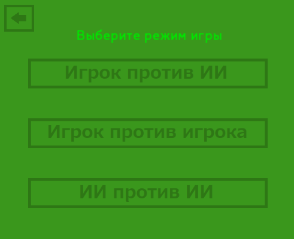
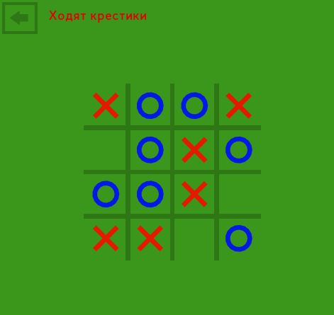

# Tic tac toe Love2D




## Описание
Данная игра была создана с помощью фреймворка Love2D на языке Lua.
Love2D https://love2d.org/wiki/Main_Page

В игре реализовано несколько режимов игры:
    Игрок против ИИ
    Игрок против Игрока
    ИИ против ИИ

Так же есть возможность выбрать размер игрового поля.

## Исходный код
Весь исходный код находится в папке game.
dll и exe файлы являются частью фреймворка Love2D.

## Установка
### 1 Скачайте файлы игры в любую папку
```bash
git clone https://github.com/MindYume/Tic-tac-toe-Love2D.git
```
### 2 Для запуска запустите start.bat или зайдите в папку demo и запустите game.exe
